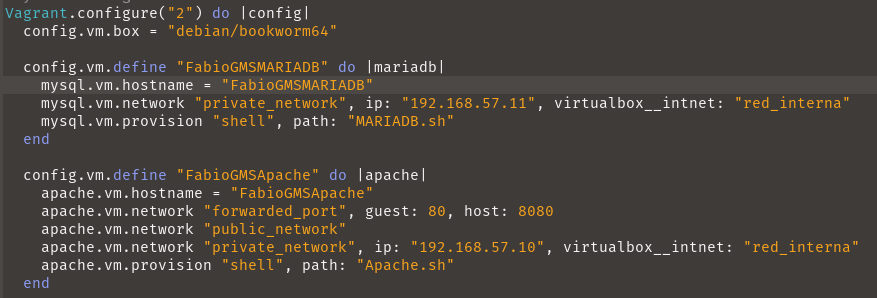
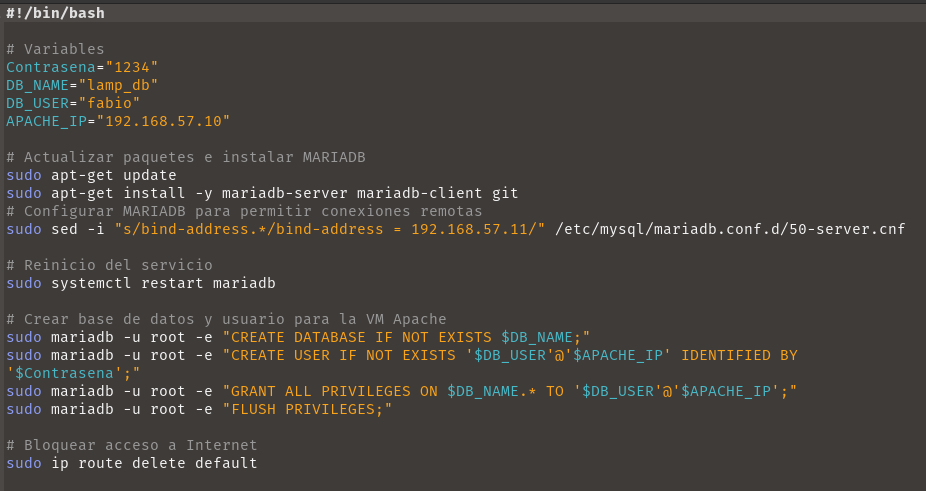

# Pila LAMP

## Archivo Vagrantfile
Para generar nuestro archivo de Vagrant, debemos ejecutar el comando: **vagrant init**.  
Una vez creado el `Vagrantfile`, necesitamos editarlo siguiendo el ejemplo de la imagen para configurar las dos máquinas virtuales. Primero configuraremos la máquina de MySQL, ya que si no lo hacemos así, se produciría un error al crear los usuarios y las tablas durante el aprovisionamiento. En la máquina de Apache, haremos una redirección del puerto 80 al 8080. Ambas máquinas tienen una ip fija de la misma red.  

## Archivo de Aprovisionamiento MARIADB
En el archivo `MARIADB.sh` automatizaremos todo el proceso de instalación de `mariadb-server`, configuraremos las conexiones remotas, restringiremos el acceso a Internet y crearemos un usuario con los permisos necesarios para usarlo desde Apache. La edición se hará de manera similar a la que muestra la imagen.  

## Archivo de Aprovisionamiento Apache
En `Apache.sh` se realizará la instalación de Apache, PHP, Git y el cliente de MySQL. Además, copiaremos y editaremos el archivo de configuración por defecto, habilitándolo; clonaremos el repositorio proporcionado, modificaremos el archivo `config.php` y finalmente importaremos la base de datos. Además, borraremos los archivos innecesarios. La edición seguirá el ejemplo de la imagen.  

## Sitio web
Si todo se ha configurado correctamente, al acceder en el navegador a `http://localhost:8080/` veremos nuestra página web conectada a la base de datos.  
Cabe recalcar que es posible que tengas que borrar la caché del navegador para poder ver el sitio web.

